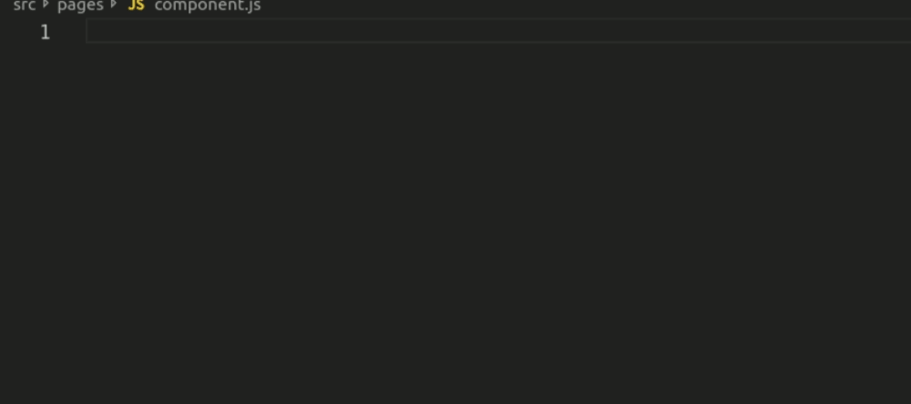

# Evergeen Code Snippets

## VS Code Evergreen Snippets

---

This extension contains code snippets for [Project Evergreen](https://github.com/projectevergreen). This is based off the vscode-react extension.

## Installation

In order to install an extension you need to launch the Command Pallete (Ctrl + Shift + P or Cmd + Shift + P) and type Extensions.
There you have either the option to show the already installed snippets or install new ones.

## Supported languages (file extensions)

- JavaScript (.js)

## Usage

Create a new .js file and then type 'evc' + tab

## Snippets

Below is a list of all available snippets and the triggers of each one. The **⇥** means the `TAB` key.

| Trigger | Content                  |
| ------: | ------------------------ |
|  `evc→` | class component skeleton |
